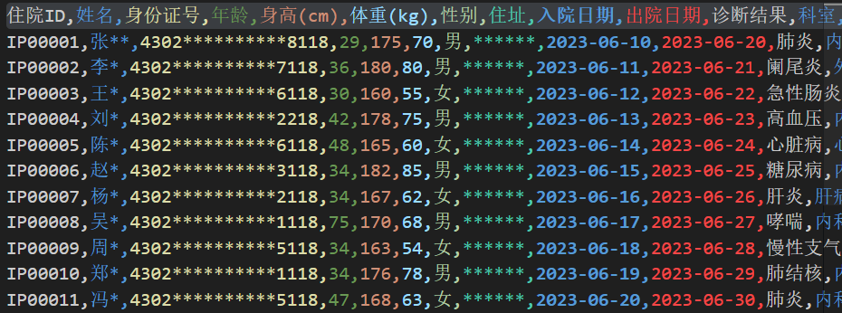
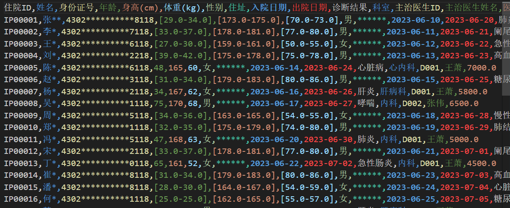
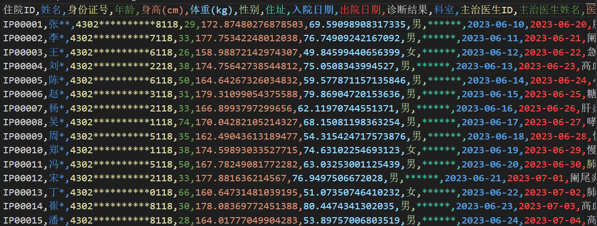

### 任务二：为医疗学术界提供数据服务(隐私数据保护)

### 数据脱敏：请现使用数据脱敏的相关技术，将个人基础信息进行脱敏处理  
    使用*遮盖敏感信息中间值的方式进行数据脱敏

### 数据匿名：KACA算法的k-匿名技术将数据进行进一步处理
    使用KACA算法进行k-匿名技术，使用年龄,身高(cm),体重(kg),性别,住址作为准标识符

### (拓展要求)数据扰乱：使用差分隐私算法进一步将个人信息加密
    使用差分隐私算法，加入噪声，对数据进行扰乱，加密个人信息
